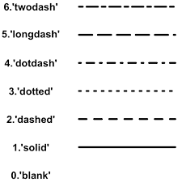

# How to Add a New Model


## Table of Contents
---

- [Overview](#overview)
- [Quick Start](#quick-start)
    - [Generate a new model](#generate-a-new-compute-model)
    - [MacOS / Linux](#➜-macos-or-linux)
    - [Windows](#➜-windows)
- [Adding a New Model](#adding-a-new-model)
    - [__init__.py](#➜-initpy)
    - [<model_name>.py](#➜-model_namepy)
    - [<model_name>_result.py](#➜-model_name_resultpy)
    - [config.json](#➜-configjson)
    - [Optional Config Parameters](#➜-optional-config-parameters)

<br>

## Overview
---

[Macbeth](https://github.com/wsu-cpts421-sp22/macbeth) strives to make
adding new models as easy as possible.  This document will walk you
through the process of adding a new model to the system. This document
assumes that you have already set up the development environment as
described in the [README](../README.md).

In the current form, Macbeth only supports deterministic models, so this document
will assume that is what you are adding. We plan to
add support for stochastic models in the future.

In this guide, we repeatedly say `<model_name>`; we expect that you replace `<model_name>` fully with the name of your model.

<br>

## Quick Start
---

### Generate a New Compute Model

<br>

For quick development, you can quickly create a skeleton of a new model by using the
<i>[generate-new-compute-model.sh](../scripts/sh/generate-new-compute-model.sh)</i>
script as shown below. This script will generate a new model package in the
<i>[macbeth_backend.computations](../macbeth_backend/computations/)</i> directory
based on the `<model_name>` passed in as an argument. 

### ➜ MacOS or Linux
```sh
# MacOS or Linux
./scripts/sh/generate-new-compute-model.sh <model_name>
```

### ➜ Windows
```powershell
# Windows
.\scripts\ps\generate-new-compute-model.ps1 <model_name>
```

<br>

## Adding a New Model
---

It is important to note that [Macbeth](../README.md) is designed to dynamically load
the models at runtime. Once a model is added to the system, Macbeth will automatically
load the model and make it available to the user. The benefit of this approach is that
the user does not need to worry about importing the model into the system. As long as
the package exists in the <i>[macbeth_backend.computations](../macbeth_backend/computations/)</i>
directory, Macbeth can load the model.

Because of this implementation, we have a few requirements and restrictions for adding
a new model to the system. The following sections will walk you through the process of
adding a new model to the system.

For any model to be added to the system, it must follow the following package structure.
Each file will be explained in this section.

<b>Required Files for a New Model</b>
```
macbeth_backend/computations/<model_name>/
├── __init__.py
├── <model_name>.py
├── <model_name>_result.py
└── config.json
```

### ➜ __init__.py

<br>

This file can be left blank. It is only needed for the model directory to be classified
as a package in Python. This allows Macbeth to identify the package exists. For more information,
you can refer to the
[Python Documentation: Section 6](https://docs.python.org/3/tutorial/modules.html).

<br>

### ➜ <model_name>.py

<br>

The `<model_name>.py` file hosts your computation of the model. Because Macbeth loads in these
models dynamically, it is important to use the same function names for performing the computation.
Each model needs to inherit from the
[InterfaceComputeModel](../macbeth_backend/computations/interface_compute_model.py).

The `self.__init__()` method needs to accept all input
parameters needed to perform the computation. 

The `self.compute_model()` method should accept no arguments and should do the computation using the parameters defined in the `self.__init__()` method. 

<br>

<b>Example</b>

For the computation of [ZombieSEIR](../macbeth_backend/computations/zombie_seir/zombie_seir.py), 
it requires three parameters: <i>infection probability</i>, <i>infection duration</i>, and
<i>latent period</i>, so the `self.__init__()` method should look like: 

```py
def __init__(self, infect_prob, infect_duration, latent_period):
        self.infect_prob = infect_prob
        self.infect_duration = infect_duration
        self.latent_period = latent_period
```

<br>

### ➜ <model_name>_result.py

<br>

When implementing the `self.compute_model()` method in the
[InterfaceComputeModel](../macbeth_backend/computations/interface_compute_model.py),
there was a design choice due to a limitation in serializing and deserializing the
request and response to the server. When returning the result of the computed model,
it is necessary to use a Python dataclass object. Using the ZombieSEIR as an example
again, [zombie_seir_result.py](../macbeth_backend/computations/zombie_seir/zombie_seir_result.py)
is a dataclass that contains each output variable from the computation.

In the `self.compute_model()` method in [InterfaceComputeModel](../macbeth_backend/computations/interface_compute_model.py),
it is required to return the results as a Python dataclass object defined in `<model_name>_result.py`.

For each variable being returned, include its type as well as shown in the example. Use types such as `int`, `float`, `str`, and `list`. 
Do not use types that are derived from an external library.

<br>

<b>Example</b>

For ZombieSEIR, [zombie_seir_result.py](../macbeth_backend/computations/zombie_seir/zombie_seir_result.py)
is a dataclass that contains each output variable from the computation as shown below.

```py
@dataclass
class ZombieSEIRResult:

    t: list
    s: list
    e: list
    i: list
    r: list
```

Here is how the `self.compute_model()` method for ZombieSEIR returns the output using the dataclass defined above.

```py
def compute_model(self, **kwargs):
        s0 = 0.9999
        e0 = 0.
        i0 = 0.0001
        r0 = 0.

        # ... Redacted for Example

        t = numpy.vstack(time_series).flatten()
        s, e, i, r = numpy.column_stack(outcome_series)
        return ZombieSEIRResult(t, s, e, i, r)
```

<br>

### ➜ config.json

<br>

The config file contains information regarding the model. 
This enables us to display who is the author, a description of the model,
and the parameters that it needs in order to work properly. 
Include the following information in your config file:

<table>
    <tr>
        <th>Parameter</th>
        <th>Description</th>
    </tr>
    <tr>
        <td>Title</td>
        <td>
            The name of the model inside of the package.
        </td>
    </tr>
    <tr>
        <td>Version</td>
        <td>The version of the model this implementation represents.</td>
    </tr>
    <tr>
        <td>Author</td>
        <td>The creator of the model.</td>
    </tr>
    <tr>
        <td>Description</td>
        <td>A high-level overview of the model.</td>
    </tr>
    <tr>
        <td>Type</td>
        <td>Deterministic or Stochastic</td>
    </tr>
    <tr>
        <td>AuthorLink</td>
        <td>A link referencing more detail regarding the model.</td>
    </tr>
    <tr>
        <td>Parameters</td>
        <td>
            A list of parameter inputs required for the model. These are the
            inputs described in the self.__init__() method of the compute
            model.
        </td>
    </tr>
    <tr>
        <td>GraphingData</td>
        <td>
            An object containing X details and each corresponding Y graphing
            details.
        </td>
    </tr>
</table>

IMPORTANT: For the `VariableName` field, it is important that the
variable it is representing in the model matches exactly with
this name. `VariableName` will try to match to the argument name given in the
`self.__init__()` arguments. If they do not match, then the parameter will not
properly be injected into the compute model.

<br>

<b>Example</b>

```json
{
    "Title": "",
    "Version": 1.0,
    "Author": "",
    "Description": "",
    "Type": "",
    "Authorlink": "",
    "Parameters": [
        {
            "Name": "",
            "VariableName": "",
            "Type": "",
            "Description": "",
            "Min": 0,
            "Max": 10000,
            "DefaultValue": 1
        }
    ],
    "GraphingData": {
        "X": {
            "Name": "",
            "VariableName": "",
            "Type": "",
            "Description": "",
            "Units": ""
        },
        "Y": [
            {
                "Name": "",
                "VariableName": "",
                "Type": "",
                "Description": "",
                "Units": ""
            }
        ]
    }
}
```

<br>

### ➜ Optional Config Parameters

<br>

Macbeth also supports the use of changing line type and color for the graphed output. These can
be described in the `GraphingData` section of the config.

If no <i>line type</i> is specified, by default it will use the solid line type.
If no <i>color</i> is specified, by default it will use one of six default colors.

For <i>line types</i>, the following are supported by name:



For <i>colors</i>, there are two ways to indicate what color to use:

- a valid hex code like `#A52A2A`
- a supported color name

Here are a few examples of color names that are supported:

```
black,
blue,
brinkpink,
brown,
coral,
cyan,
darkblue,
darkgreen,
darkorange,
darkred,
gold,
green,
gray,
grey,
hotpink,
indigo,
lightblue,
lightpink,
magenta,
maroon,
navy,
orange,
orangered,
pink,
purple,
red,
salmon,
springgreen,
summersky,
yellow
```

This can be added to the `config.json` in the `Y` axis objects.

<br>

<b>Example</b>

```json
// Example 1
"GraphingData": {
        "Y": [
            {
                "Name": "",
                "VariableName": "",
                "Type": "",
                "LineType": "dotted",
                "Color": "blue",
                "Description": "",
                "Units": ""
            }
        ]
    }

// Example 2
"GraphingData": {
        "Y": [
            {
                "Name": "",
                "VariableName": "",
                "Type": "",
                "LineType": "dashed",
                "Color": "#A52A2A",
                "Description": "",
                "Units": ""
            }
        ]
    }

```

<br>

## Conclusion

And that should be it! If all of those details are addressed, you should be able to re-run
the server and the new model will be available in the drop down menu for selecting a
computation to run.
