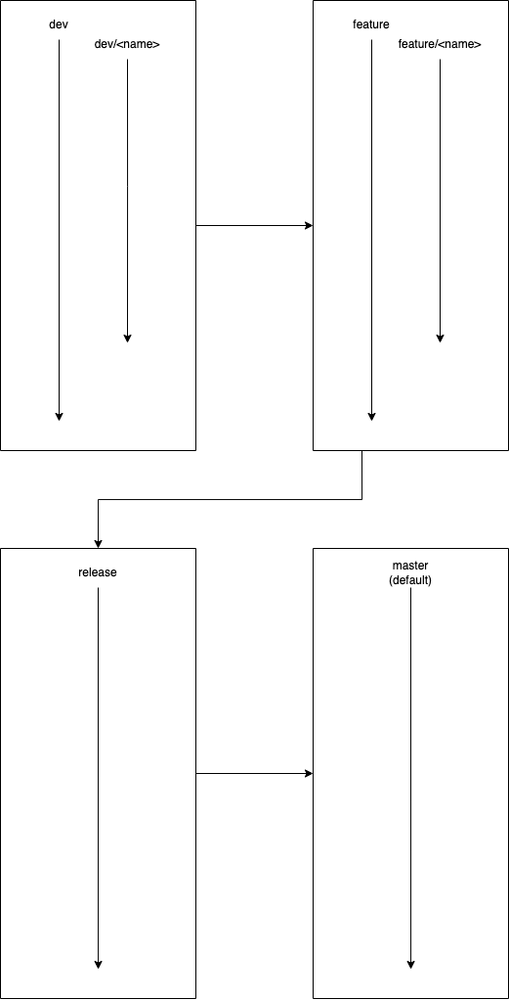

# Convention Guidelines

## Styling Conventions

todo

## Branch Conventions

For structuring our branches, we are planning to follow the following format:  

  

For example, for creating a new feature branch, we would use the following structure:  

```
git branch -b feature/<feature_name>
```

The same would be used for dev branches.  

```
git branch -b dev/<developer_name>
```

For the workflow, most work will be done in users respective `dev/<developer_name>` branch until there is a working 
implemtation of a subtask for the feature. It can then be sent to its `feature/<feature_name>` branch as a squashed 
commit to be included in the feature.  

When all subtasks are completed for the feature, it can then be given a pull request into the `release` branch 
where the team will review the code, or it can be included in the primary `feature` if more features are to be included 
before a `release`. Pushing to the primary `release` branch should also undergo a code review.  

Once a pull request was approved for the `release` branch, the only modifications to the version release will be bug fixes. 
After all bugs have been addressed, we can send the release version to the `default` branch. No changes other than 
new versions should be added to the `default` branch.
